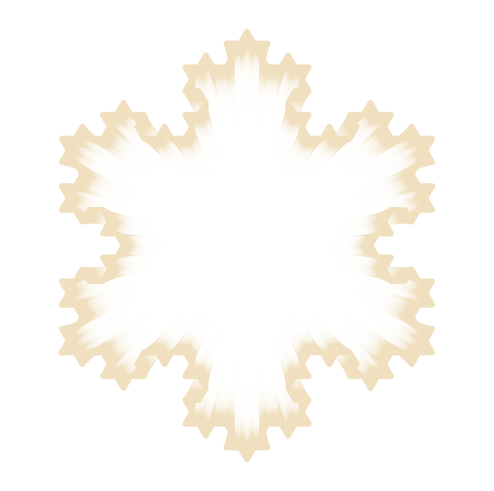
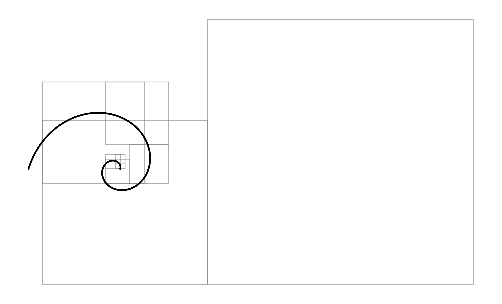

# Fractals

A collection of Python scripts for generating and visualizing various fractal patterns, including classic fractals like the Dragon Curve, Koch Snowflake, Mandelbrot Set, and artistic variations using different rendering techniques.

## Overview

This repository explores the mathematical beauty of fractals through Python implementations. Each script generates unique fractal patterns using different algorithms and visualization methods, from L-systems to iterated function systems (IFS) and complex number iterations.

## Gallery & Usage

### 🐉 Classic Fractals

#### **Dragon Curve**
*Implementation using L-system rules.*


- **Scripts**: `dragon_curve/dragon.py`, `dragon_curve/dragon_koch_hybrid.py`
- **Features**: Classic Heighway dragon curve, hybrid variations.

#### **Koch Snowflake**
*Recursive subdivision algorithm.*


- **Scripts**: `koch_snowflake/koch_*.py`
- **Features**: Configurable order and scale, mathematical precision.

#### **Mandelbrot Set**
*Complex number iteration visualizations.*


- **Scripts**: `mandelbrot/mandelbrot_*.py`
- **Features**: Multiple rendering approaches (PIL, matplotlib), viewport control, reflections.

---

### 🌿 Nature-Inspired Fractals

#### **Fractal Trees**
*Recursive branching algorithms.*


- **Scripts**: `fractal_trees/tree.py`
- **Features**: Realistic structures, configurable branch angle and depth.

#### **Fibonacci Spiral**
*Golden ratio visualization.*


- **Scripts**: `fibonacci_spiral/fibonacci.py`
- **Features**: Visualizes relationship between Fibonacci sequence and nature.

---

### 🎨 Artistic & Experimental

#### **Flame Fractals**
*Iterated function system (IFS).*


- **Scripts**: `flame_fractals/flame_1.py`
- **Features**: Stochastic point generation, organic patterns.

#### **Triangulation Art**
*Delaunay triangulation with artistic clustering.*


- **Scripts**: `clint_fulkerson_meshes/triangulation.py`
- **Features**: Inspired by Clint Fulkerson, high-DPI output.

---

## Requirements

The project uses the following Python libraries:

- **numpy** - Numerical computations
- **matplotlib** - 2D plotting and visualization
- **PIL (Pillow)** - Image processing
- **turtle** - Graphics library (standard library)

## Customization

You can modify parameters in the scripts to change the output:

```python
# Example: Increasing recursion depth in dragon.py
iterations = 14  # Higher values = more detail
```

## Technical Details

- **L-Systems**: Used for Dragon and Koch curves (string rewriting rules).
- **Iterated Function Systems (IFS)**: Used for Flame fractals (stochastic transformations).
- **Recursive Algorithms**: Used for Trees and Snowflakes (direct subdivision).

## Credits

- Triangulation art inspired by Clint Fulkerson's geometric work.
- Classic fractal algorithms based on mathematical literature.
